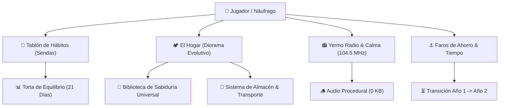

# 📻 UPROTA: El Refugio del Náufrago
### *Dossier Oficial de Producto, Sinopsis & Arquitectura de Software*
**Versión:** 3.3 (Build de Producción) | **Plataforma:** PWA Offline-First / Web Móvil & Desktop  
**Desarrollado por:** Clan UPROTA | **Liderazgo:** Anigami Agadni (Director) & Nexo (Ingeniero Principal)

---

## 🏜️ 1. SINOPSIS OFICIAL

> *En un mundo colapsado por el ruido digital, la dopamina barata y la prisa constante, eres un náufrago que despierta en el "Punto Cero" de un Yermo árido.*
>
> *No tienes nada más que un toldo desgarrado, un fogón apagado y una vieja radio a transistores sintonizada en los 104.5 MHz. A través de la estática, la voz del Operador Central transmite una verdad inmutable: **para reconstruir el mundo exterior, primero debes reconstruir tu propio orden interior**.*
>
> *UPROTA transforma la disciplina personal, la salud mental y la gestión de metas en una odisea de supervivencia rústica. Cada acción física, cada vaso de agua, cada lectura sosegada y cada registro financiero se convierten en madera, clavos, provisiones y agua pura para levantar tu refugio desde una choza de palets hasta una Ciudadela Libre autosustentable. Aquí no hay rachas que te castiguen si tienes un mal día, sino una brasa que jamás se apaga y te invita a levantarte.*

---

## 💎 2. PROPUESTA DE VALOR: ¿POR QUÉ UPROTA?

La mayoría de las aplicaciones de productividad comerciales fallan por tres motivos:
1. **La tiranía de la racha (Streak Anxiety):** Si fallas un día tras una racha de 30, el contador vuelve a cero, generando culpa y abandono de la app.
2. **Dependencia de la nube y pérdida de privacidad:** Tus datos personales y vulnerabilidades quedan alojados en servidores de terceros que monetizan tu atención.
3. **Falta de resonancia emocional:** Las listas de tareas estándar son frías y utilitarias.

### 🛡️ Los Tres Pilares Disruptivos de UPROTA:
- **Filosofía Anti-Frustración (*Tabula Rasa*):** Los hábitos se evalúan en ventanas de equilibrio de 21 días (La Torta de los 4 Pilares). Romper una cadena no borra tu historia; activa un botón de reinicio digno que celebra el nuevo comienzo.
- **Soberanía y Privacidad Absoluta (Local-First):** 0 KB de datos enviados a la nube. Todo vive en tu dispositivo mediante `IndexedDB`, funcionando con o sin conexión a internet de forma indefinida.
- **Gamificación Tangible & Calma Mental:** No hay barras de progreso vacías; cada hábito completado evoluciona físicamente tu diorama en pixel art, desbloquea sabiduría clásica universal y genera paisajes sonoros relajantes sin consumir datos.

---

## 📦 3. INFORME EXHAUSTIVO DE MÓDULOS Y CONTENIDO

---

### 🏛️ Módulo I: La Forja de Sendas & Los 4 Pilares de Vida
* **Los 4 Pilares del Ser:** Cada acción diaria alimenta uno de los 4 pilares fundamentales:
  - 🏋️‍♂️ **Cuerpo:** Salud física, descanso, nutrición y energía vital.
  - 🧠 **Mente:** Estudio, trabajo profundo, resolución técnica y enfoque.
  - 🔥 **Espíritu:** Meditación, gratitud, templanza, reflexión y sabiduría.
  - 🏡 **Entorno:** Orden del espacio, finanzas personales, hogar y relaciones.
* **La Torta Dorada de 21 Días:** Un algoritmo circular evalúa la distribución de tus hábitos en las últimas 3 semanas. Si mantienes todos los pilares entre el 20% y el 30%, la torta resplandece en oro puro.
* **Progresión Orgánica de Sendas:**
  - *Nivel 0 (Punto Cero):* 4 ranuras activas (piso mínimo 1-1-1-8).
  - *Nivel 2 (Techo de Chapa):* 6 ranuras.
  - *Nivel 5 (Fortaleza):* 8 ranuras.
  - *Nivel 8 (Complejo Autosustentable):* 10 ranuras.
  - *Nivel 10 (Ciudadela Libre):* 12 ranuras máximas.

---

### 🏕️ Módulo II: El Hogar & El Diorama de 11 Niveles
Un lienzo visual interactivo en Pixel Art de alta definición retro (128x96 px escalado sin distorsión):
* **11 Fases de Construcción:**
  1. **Niv 0 - Punto Cero:** Lona rasgada, fogón apagado, restos de palet.
  2. **Niv 1 - Cajones:** Paredes de palets reforzados y brasas vivas.
  3. **Niv 2 - Techo de Chapa:** Tejado metálico y barril recolector de lluvia.
  4. **Niv 3 - Huerto Elevado:** Cabaña aislada con chimenea y primeros cultivos.
  5. **Niv 4 - Taller de Reparación:** Banco de carpintería y horno de barro.
  6. **Niv 5 - Fortaleza Energética:** Paneles solares y bici-generador.
  7. **Niv 6 - Taller de Restauración:** Tanque de electrólisis y bicicleta con parrilla.
  8. **Niv 7 - Enclave Comercial:** Alero de caravana, báscula y sacos de sal.
  9. **Niv 8 - Complejo Autosustentable:** Invernadero de policarbonato y trailer ciclista acoplado.
  10. **Niv 9 - Santuario Comunitario:** Muro de gaviones, cisterna con biofiltro y mástil de balizas dobles.
  11. **Niv 10 - Ciudadela Libre:** Bastión volcánico, cúpula geodésica solar, torre vigía con reflector y convoy blindado con estandarte dorado.
* **Ciclo Circadiano de Iluminación (60 FPS):** Cuatro filtros atmosféricos que transforman el refugio en tiempo real según la hora de tu dispositivo (*Amanecer dorado, Mediodía nítido, Crepúsculo cálido, Noche profunda*).

---

### 📜 Módulo III: Biblioteca de Sabiduría Clásica Universal
Un compendio de las 10 obras cumbre del pensamiento humano para forjar templanza diaria:
* **Obras Incluidas:** *La Santa Biblia*, *Meditaciones* (Marco Aurelio), *Enquiridión* (Epicteto), *Cartas a Lucilio* (Séneca), *El Arte de la Guerra* (Sun Tzu), *Tao Te Ching* (Lao Tsé), *El Libro de los Cinco Anillos* (Musashi), *Hagakure* (Tsunetomo), *El Arte de la Prudencia* (Gracián) y *Humano, Demasiado Humano* (Nietzsche).
* **Mecánica de Bono Activo:** Puedes equipar hasta **2 libros simultáneamente**. Mientras estén equipados, otorgan un **+1 permanente** al pilar de Mente o Espíritu, impactando en vivo el equilibrio de tu Torta de 21 Días y desplegando aforismos inspiradores al amanecer.

---

### ⚓ Módulo IV: Faros de Ahorro & Metas a 24 Semanas
Diseñado para dominar metas financieras y compromisos vitales a mediano y largo plazo:
* **Estructura Semestral Calibrada:** Ciclos exactos de 24 semanas (168 días) con modalidad semanal, quincenal o mensual.
* **Ciclo I (Días 7 a 175):** *Faro Semestral I: Los Cimientos*.
* **Ciclo II (Días 176 a 344):** *Faro Semestral II: La Travesía del Convoy*.
* **Transición al Año 2 (Modo Guardián):** Al cruzar el Día 365, el sistema no se resetea. El progreso se consolida y se desbloquea el *Ciclo III: El Guardián del Yermo* (Días 366 a 730) sin fricción.

---

### 📻 Módulo V: Yermo Radio (104.5 MHz) & Paisajes de Calma (0 KB)
* **La Cabina del Director:** 7 transmisiones radiofónicas estructuradas para ser locutadas con voz humana natural y moduladores de voz (Don Chui, Elena, Doña Concha, Bebé Fitolantro).
* **Sintetizador Web Audio Procedural:**
  - *🪵 El Fogón de Mezquite:* Crujidos estocásticos que inducen relajación.
  - *🌧️ Lluvia en Lámina:* Ruido rosa filtrado para concentración y estudio.
  - *📻 Portadora 104.5 MHz:* Tono senoidal puro que aísla el ruido ambiental.
* **Modo Pomodoro & Temporizador:** Modos de 25 min, 45 min o continuo con *fade-out* suave de 3 segundos y desconexión total para no consumir batería.
* **Procesador Anti-Clipping:** `DynamicsCompressorNode` activo que previene distorsiones en altavoces móviles.

---

### 💾 Módulo VI: Sistema de Respaldo & Snapshots Trimestrales
* **Copias Automáticas Invisibles:** Snapshots guardados en el almacenamiento local en los Días 66, 90, 168, 180, 270 y 365.
* **Centro de Control de Respaldo:** Pestaña dedicada en el Centro de Ayuda donde el usuario puede previsualizar sus copias, descargar un archivo `.json` de seguridad o restaurar su estado con 1 clic.

---

## 📊 4. ESPECIFICACIONES TÉCNICAS & ARQUITECTURA

| Característica | Especificación de Producción |
| :--- | :--- |
| **Arquitectura de Código** | ES6 Vanilla Modular (33 módulos desacoplados sin dependencias externas) |
| **Peso Total de la Aplicación** | Menor a 3.5 MB (incluyendo todo el arte pixel art y emojis) |
| **Consumo de Servidor** | **0 KB en backend** (Cliente estático servible en cualquier CDN / GitHub Pages) |
| **Base de Datos** | `IndexedDB` asíncrono con fallback a `localStorage` |
| **Audio Engine** | Web Audio API procedural nativo (0 MB de archivos de audio descargados) |
| **Compatibilidad** | iOS Safari, Android Chrome, Edge, Firefox, Desktop PWA instalable |
| **Modo Offline** | Service Worker `CacheFirst` (`uprota-cache-v3.3`) con soporte 100% sin red |

---

## 🎯 5. CONCLUSIÓN COMERCIAL

**UPROTA v3.3** no es simplemente un rastreador de hábitos; es un **ecosistema de soberanía personal y resiliencia**. 

Al combinar la calidez estética del pixel art, la profundidad de la filosofía clásica, una ingeniería local-first libre de rastreadores y una psicología del comportamiento compasiva y firme, UPROTA se posiciona como una herramienta única en su clase: un refugio digital diseñado para durar, acompañar y transformar la vida del usuario día con día.
