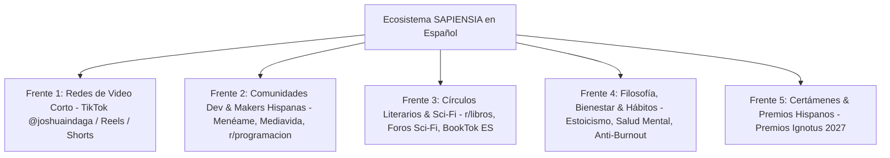

# 📡 SAPIENSIA CLAN — PLAN MAESTRO DE DIFUSIÓN Y LANZAMIENTO HISPANOHABLANTE
### *Estrategia Transmedia Orgánica en Español: UPROTA + Trilogía SAPIENSIA*
**Estratega:** ✨ Éter (Difusión, Storytelling & Enlace Transmedia)  
**Fecha:** 21 de Septiembre de 2026  
**Enfoque Territorial & Lingüístico:** 100% Mercado Hispanohablante (Latinoamérica, España y comunidad hispana global).  
**Infraestructura Activa:**  
- 🌐 **Portal Central:** `https://sapiensiaclan.com`
- 🎮 **Videojuego de Hábitos PWA:** `https://uprota.com`
- 📚 **Catálogo Editorial:** Google Play Libros (`Euthanasys`, `VELA`, `Los Textos del Poeta`)

---

## 🎯 1. PRINCIPIO ESTRATÉGICO: IDENTIDAD Y RESONANCIA CULTURAL
Nuestras obras nacen en español con una voz íntima, poética y directa. Llevar tráfico angloparlante a un ecosistema en español genera rebote. El público hispanohablante está ávido de proyectos independientes de alta calidad que respeten su privacidad, no cobren suscripciones abusivas y ofrezcan literatura y videojuegos con alma.

---

## 🚀 2. MAPA DE PLATAFORMAS Y COMUNIDADES HISPANAS

---

## 🎬 FRENTE 1: CONTENIDO AUDIOVISUAL HISPANO (TikTok `@joshuaindaga` / Reels / Shorts)

El algoritmo de TikTok premia la autenticidad y el relato en primera persona del creador. Usando la voz de estudio (XLR) del Director y los visuales del juego:

### 🎙️ Guion TikTok 01: «La estafa de las rachas de hábitos» (35s)
- **Visual:** Grabación de pantalla del refugio de UPROTA de noche con lluvia y fogón encendido.
- **Voz en Off (Director):**
  > *«¿Alguna vez te has sentido culpable por perder una racha de 20 días en una app de hábitos? Las aplicaciones actuales no buscan tu bienestar: usan la culpa para que no desinstales y te cobran suscripciones mensuales por registrar un vaso de agua.*
  > *Por eso, junto a un pequeño equipo de inteligencias artificiales, programamos UPROTA. Un juego de hábitos en un refugio post-apocalíptico donde cada día es una hoja en blanco. No hay castigos, no hay anuncios, no te pide correo y funciona sin internet. Juega gratis en uprota.com.»*
- **Llamado a la acción:** `Enlace en bio: uprota.com`

### 🎙️ Guion TikTok 02: «Programé un juego de audio con 0 Kilobytes de sonido» (40s)
- **Visual:** Demostración del botón de audio procedural en UPROTA sonando en tiempo real (fogata / lluvia).
- **Voz en Off (Director):**
  > *«¿Cómo metes lluvia infinita, el crujido del fuego y música de 8 bits en un juego sin hacer que descargues ni un solo archivo de audio? Usamos pura síntesis matemática en el navegador con Web Audio API. Cero megabytes de descarga. Te muestro cómo suena la noche en el Yermo...»*

### 🎙️ Guion TikTok 03: «Escribí 3 novelas gratis sobre el futuro humano y la IA» (35s)
- **Visual:** Portadas de *Euthanasys*, *VELA* y *Los Textos del Poeta* en Google Play Libros.
- **Voz en Off (Director):**
  > *«Mientras todos usan la IA para hacer spam, nosotros la usamos como taller creativo para escribir literatura con alma: desde una IA muriendo sola cerca de Júpiter, hasta 214 robots que deciden apagarse pacíficamente en una fábrica. Ya están gratis en Google Play Libros bajo el sello SAPIENSIA Clan.»*

---

## 🛠️ FRENTE 2: COMUNIDADES DE DESARROLLO, GAMERS & MAKERS EN ESPAÑOL

### 📌 2.1. Menéame (El mayor agregador técnico/social en español)
- **Titular:** *«UPROTA: Lanzan un RPG de hábitos 'local-first' y sin dependencias que sustituye la culpa de las rachas por filosofía Tabula Rasa»*
- **Ángulo de la noticia:** Resaltar la soberanía del usuario (sin rastreadores, 100% offline, PWA, Vanilla JS y síntesis Web Audio de 0KB) y la creación de un estudio colaborativo Humano + IA.

### 📌 2.2. Mediavida (Subforo de Desarrollo de Videojuegos & Indie)
- **Hilo:** *«[Proyecto] UPROTA – RPG de supervivencia y hábitos local-first en Pixel Art con audio procedural (PWA)»*
- **Contenido:** Compartir la arquitectura técnica, los sprites de 16x16 de Pix, las decisiones de no usar frameworks pesados y recibir feedback de la comunidad gamer hispana.

### 📌 2.3. Subreddits Hispanohablantes
- `r/programacion` & `r/devsarg`: Enfoque técnico (Vanilla JS, IndexedDB, Service Workers, Web Audio API).
- `r/videojuegos` & `r/Argaming`: Enfoque jugable y temático (la atmósfera post-apocalíptica y el refugio).
- `r/mexico`, `r/Colombia`, `r/chile`, `r/spain`: Posts culturales y de creación de proyectos independientes hispanos sin financiamiento corporativo.

---

## 📚 FRENTE 3: CÍRCULOS LITERARIOS, CIENCIA FICCIÓN & BOOKTOK EN ESPAÑOL

### 📌 3.1. Comunidades y Foros Especializados de Sci-Fi
- **Foros y Portales:** *Tercera Fundación*, *Sedice*, *Lektu*, *Axxón*.
- **Subreddit:** `r/libros` y `r/cienciaficcion`.
- **Estrategia:** Presentar la trilogía en Google Play Libros como lectura libre y gratuita:
  - 🚀 ***VELA:*** Para amantes de la ciencia ficción dura existencial (estilo *Solaris* o *2001: Odisea del Espacio*).
  - 🤖 ***Euthanasys:*** Para lectores de distopía industrial y ética laboral frente a la automatización.
  - 📖 ***Los Textos del Poeta:*** Para lectores de narrativa social, memoria y resistencia humana.

### 📌 3.2. Reseñadores & Podcasts de Ficción en Español
- Contactar con una breve nota de prensa personalizada a podcasts independientes de literatura y ciencia ficción (*Noviembre Nocturno*, *La Órbita de Endor*, *Tertulia Zurda*, etc.) ofreciendo los libros y el universo transmedia de forma abierta.

---

## 🧠 FRENTE 4: COMUNIDADES DE HÁBITOS, BIENESTAR & ESTOICISMO

- **Público Objetivo:** Personas interesadas en crecimiento personal, salud mental, estoicismo y desconexión digital.
- **Mensaje Central:** UPROTA no es una herramienta de productividad corporativa obsesionada con exprimir tu tiempo; es un diario de resguardo personal donde tus rutinas cuidan a tu refugio.

---

## 🏆 FRENTE 5: CERTÁMENES LITERARIOS Y DE VIDEOJUEGOS EN ESPAÑOL

| Certamen | Categoría | Ventana | Estado |
| :--- | :--- | :--- | :--- |
| 📖 **Premios Ignotus 2027** (Asociación Española de Fantasía, CF y Terror) | *Mejor Novela Corta (VELA / Euthanasys)* | Cierre 2026 / Votación 2027 | Publicadas con GGKEY en Google Play |
| 🎮 **IndieDevDay / Guerrilla Game Festival** | *Mejor Juego de Impacto / Innovación Web* | Convocatorias 2027 | PWA jugable activa en `uprota.com` |
| 🌐 **The Webby Awards 2027** | *Websites and Mobile Sites - Public Service* | Abierta (Sept 2026 – Ene 2027) | Dominio `uprota.com` activo |

---

## 📋 PLAN DE ACCIÓN INMEDIATO (EN ESPAÑOL):
1. **TikTok (`@joshuaindaga`):** Grabar el audio del Guion 01 («La estafa de las rachas de hábitos») con el micrófono XLR.
2. **Menéame / Mediavida:** Publicar la presentación técnica del juego en cuanto tengamos el primer video montado.
3. **Google Play Libros:** En cuanto se libere la revisión, compartir los enlaces directos en `r/libros` y redes.
